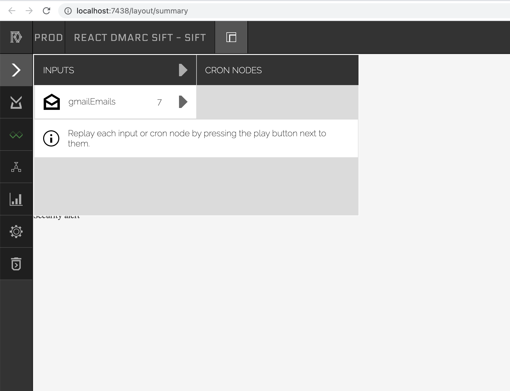
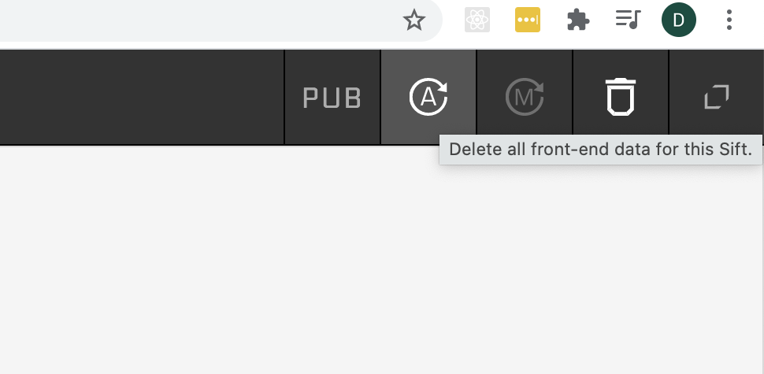
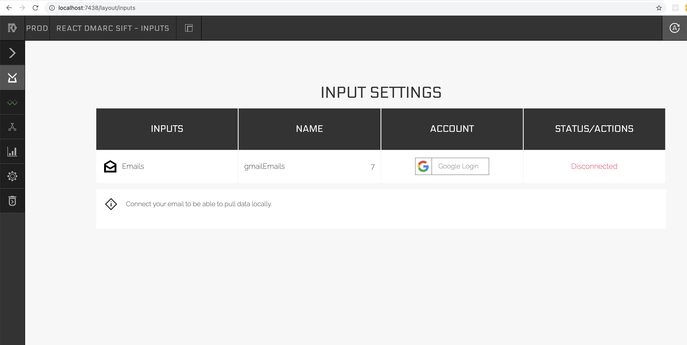
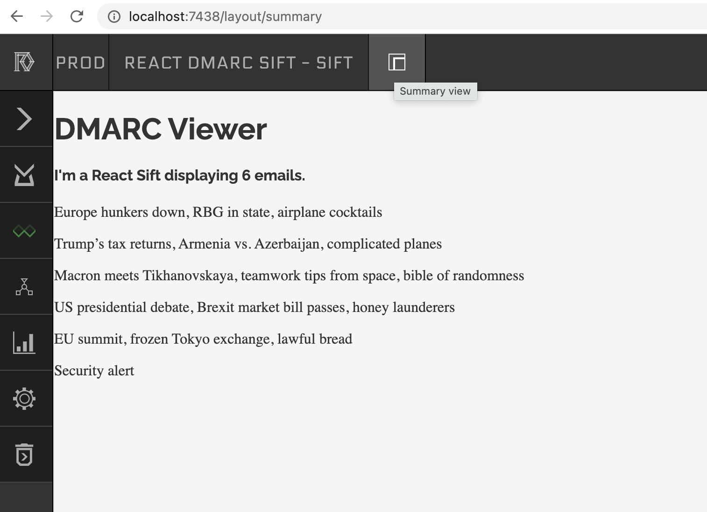
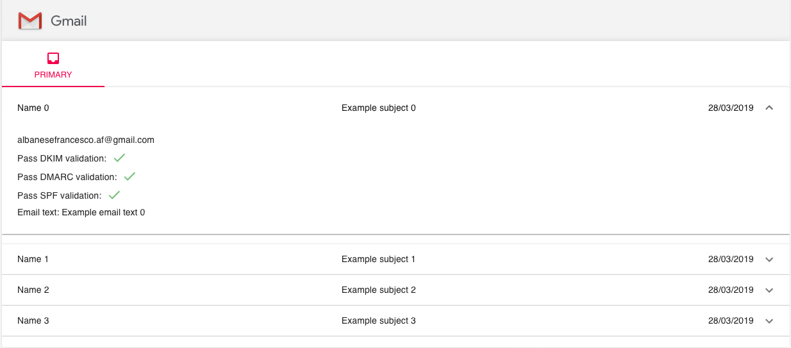
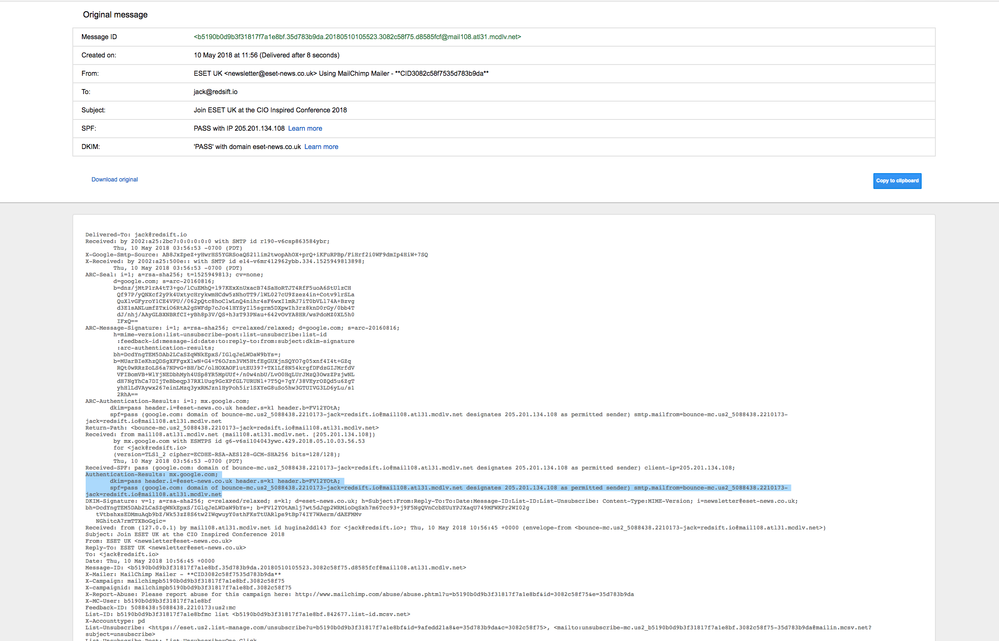

# Red Sift React/DMARC Developer Exercise

Your task is to build your first [sift](https://docs.redsift.com/docs/intro-system-overview).

## Task Details

We have given you a Sift (full stack application that runs on our Platform) that does the following:

- Streams emails from a Gmail inbox into a node
- Parses the email and counts the number of words in the body
- Display the list of emails (subject line) in a very simple React app

Your task is to add the following **TWO** functionalities to the given Sift:

### First

    - Extract and display the DMARC, SPF, DKIM status of each email
    - The information you need is contained in the `Authentication-Results` header. The email comes into `server/parse.js` in the jmap format <https://docs.redsift.com/docs/server-code-jmap>. Parse the mail headers and extract the DMARC,SPF and DKIM relevant info and send it up to the frontend for display. See the `Useful Links and references` section below for more details on the header and an example.
    - Display the results in an interesting manner on the frontend on a per email basis and provide a summary as a whole. We have an example layout below for you to use as inspiration. Also we love visualisations if you have the time to include a summary chart. There is an `App.jsx` file which contains the basic React component that you'll need to extend further.
    - Complete work in git repository with frequent commits showing us your coding processes. You can just use a local git repository.

### Second - Pick one of the following two options
#### Either
    - Aggregate the daily and weekly count of words (from the email body). 
    - Visualise this on the frontend in any form you like. 
        - Hint: Look at how parse.js stores it's data and extend it to support daily aggegation. Then think about how a weekly aggregatation can be derived from the daily aggregations.
#### Or
    - Extract IPs from the email headers (look for the `Authentication-Results` header which might contain this information). For each IP hit an external API to get the geo location information (https://ipstack.com/documentation provides a free API if you signup but feel free to use any external API). 
    - API requests can be expensive, so we'd like you to cache (hint: use our key-value stores) the result of the API requests you make and re-use it when invoked again.
    - Add the IP to the body of the email displayed on the first task.

 Please feel free to ask us for help if you are stuck with the SDK or the task.

## Running your code

- Run `redsift run -nd` in the root of this folder to start the SDK. It will open a browser window when ready, otherwise navigate to <http://localhost:7438/layout/summary> after the command.
- We have included a sample of 7 emails to get you started with the input streaming.
- Whenever you make any changes to parse.js and want to see it in action, you'll need run the input stream by using the Inputs section in the SDK 
- If the data you are sending to the frontend is not coming through even after running the input above then clear the IndexedDB data on the frontend using the delete button on the far left of the SDK and run your input steam again. 
- If you'd like to connect your own gmail account and process emails from there then you'll need to OAuth into your account using the `Inputs Manager` section of the SDK. 
- If you are lost in any other SDK screen and would like to return to the Sift summary view then use the button in the top bar. 

## Goals

This will be an opportunity to familiarise yourself with the platform and SDK, learn about the protocols DKIM, SPF and DMARC and get a better understanding of our OnDMARC product and showcase your coding talents and eye for presentation.

All of our products at Red Sift are data driven and focused on visualising and providing insight on the most important parts effectively for clients to understand and use their data.

We are looking for a simple solution with clean, well crafted code with attention to detail. Please have a consistent presentation theme and welcome you copying one from a well known website to see how you work given a set of designs.

It's a short time frame so we stress that you keep it simple but with high quality. We have an example layout below for you to use as inspiration.

Display the data your choose in a visibly pleasing, straight forward, robust manner but look forward to any additional insights you care to display. Our recommendation is to allow more time for the frontend than the parsing of the headers.

## Setup

You can carry out the task fully in our SDK - [Installation Instructions](https://docs.redsift.com/docs/sdk-installation). Currently our SDK only works on Linux or MacOS. If you have a Windows machine then please use a Linux vm.

Note: If you have any trouble with the installation of the SDK please reach out to us before you continue with the rest of the task.

Once installed run `redsift run -nd` to start project locally from root of this repository.

We have already instantied the project on the sdk, so you have a template to save you the time but it's still a good idea to checkout the [controller](frontend/src/scripts/controller.js) and [view](frontend/src/scripts/view.js) files to see the frontend integration and also to view the [email input documentation](https://docs.redsift.com/docs/creating-an-email-input) to get an understanding of the data pipeline.

You are free to choose from any of our supported languages on the backend (note running the SDK with Docker is required for non Javascript nodes) and on top of the React base you can use any frontend framework including D3 and any npm module you see fit for the job.

**Note** you will need access to a Gmail Inbox to connect to the SDK and have a dataset of emails. Let us know if this proves difficult.

### Useful Links and references

- <https://docs.redsift.com/docs/video-tutorials>
- <https://docs.redsift.com/docs/server-code-jmap>
- <https://knowledge.ondmarc.com/learn-about-dmarc>
- <https://tools.ietf.org/html/rfc7489> (detailed spec)

Below is a screenshot of typical DMARC authentication results from an raw email. You can see the main header `Authentication-Results` you need highlighted, but not there may be more useful headers which include more information for the protocols that you may get round to using.

**Note:** The last person to complete this task had issue with the library @redsift/text-utilities so giving you a warning. You should be able to do without it but highlighting now as not to cause a stumbling block.

### GOOD LUCK

One of our team will be on hand to help with any issues in the set up and provide any clarification but we hope it is easy to develop on the platform and we welcome any feedback you have regarding the experience.
